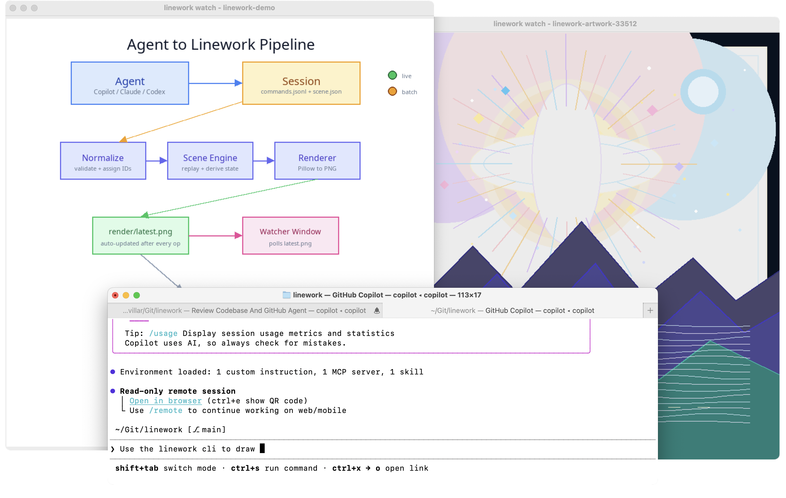

# `linework`

`linework` is a simple sketching tool for agents that allows them to draw 
shapes, place text, build diagrams, and export PNGs from the command line. 

`linework` keeps the underlying drawing objects, allowing an agent to
tweak things (*make the red box wider, change the background, relabel
that arrow*), editing the shapes in place instead of regenerating the image 
from scratch.

The agent can a read-only **watcher window** to show the drawing come together in 
real time, or work in a background process with no graphical interface.



## Prerequisites

- **[uv](https://docs.astral.sh/uv/)** — Python package and project manager.
- An **agent with terminal access** (e.g. Copilot, Claude, Codex, or VS Code).

## Install or update

On Windows:
```bash
uv tool install --link-mode copy git+https://github.com/nvillar/linework.git
```

On macOS:
```bash
uv tool install git+https://github.com/nvillar/linework.git
```


## Quick start

Give your agent a prompt like this:

```
Use the `linework` cli to draw a self-portrait.
```

Or, if you want to be more explicit: 

```
You have access to the `linework` CLI for creating drawings and diagrams.
Run `linework` with no arguments to learn how it works. Start by creating a
session, then draw a self-portrait.
```

The agent will read the built-in bootstrap guide, create a session, open the
watcher window on your screen, and start drawing.

## Tip: Visual feedback

 If your agent supports image understanding, a useful pattern is to have it view 
 the rendered PNG to verify the result visually. By viewing it, the 
 agent can catch alignment, spacing, and readability issues that aren't obvious from 
 object coordinates alone and correct them with follow-up edits.

```
 After drawing, view the latest render to check how it looks. If anything is off
 — alignment, spacing, overlap — fix it.
```

## Under the hood

Every drawing lives in a portable **session directory**. The primary interface is
**JSONL batch mode**, designed for automated agent loops. Here's what the agent
is doing behind the scenes:

```bash
# Create a session. A watcher window opens automatically
linework new --name demo

# Draw via JSONL batch (in another terminal)
cat <<'EOF' | linework run --session PATH --json
{"op":"draw.rect","payload":{"x":50,"y":50,"width":200,"height":100,"fill":"#E8E8E8","label":"box"}}
{"op":"draw.polygon","payload":{"points":[[300,50],[400,10],[400,90]],"fill":"#FF6666"}}
{"op":"draw.text","payload":{"x":70,"y":85,"text":"Hello","size":20}}
EOF

# Read back what's on the canvas
linework inspect --session PATH --json

# Export a PNG
linework export --session PATH --out diagram.png
```

The **watcher window** runs as its own process, so it stays open while the agent works across multiple commands.

Run `linework` with no arguments for the full reference.
